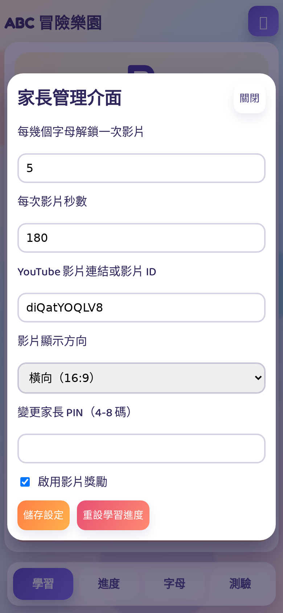
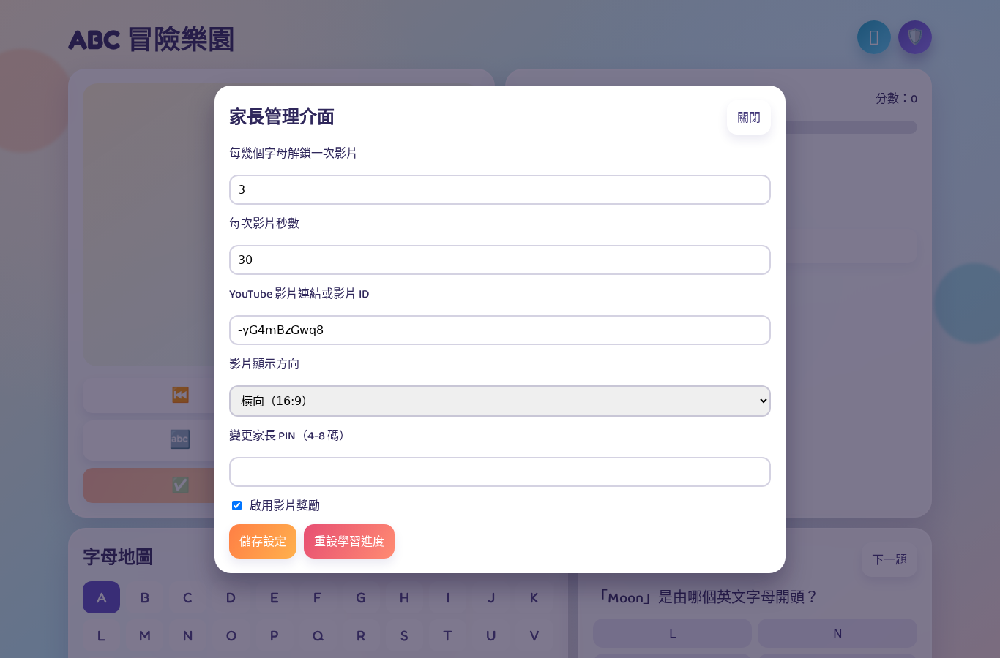

# ABC 冒險樂園 操作教學手冊

本手冊提供家長與孩子完整操作流程，包含學習模式、獎勵影片、家長管理與常見問題。

> 截圖環境：手機版視窗（390 x 844）

## 1. 開始使用

1. 啟動專案：

```bash
npm run dev
```

2. 開啟瀏覽器進入：`http://127.0.0.1:8000`（若改了埠號請使用實際埠號）。


## 2. 孩子學習流程

### 2.1 主學習畫面

- 上方會顯示目前字母、單字與圖片。
- 可使用按鈕切換上一個/下一個字母。
- 「播放字母」與「播放單字」都按過後，才能按「我學會了」。


### 2.2 學習進度

- 可查看已學數量、分數、星星與獎勵影片解鎖狀態。
- 若已解鎖可按「立即播放獎勵影片」。


### 2.3 字母地圖

- 點任一字母可快速跳到該字母。
- 已學過字母會有完成標示。


### 2.4 小測驗

- 題目會朗讀，孩子可點選選項作答。
- 答對可加分，並可能觸發學習進度更新。


## 3. 學會挑戰（我學會了）

### 3.1 開啟學會挑戰

1. 在學習畫面先按過「播放字母」與「播放單字」。
2. 按「我學會了」會跳出挑戰題目。


### 3.2 答錯處理

- 若選錯會顯示錯誤提示文字。
- 同時會播放錯誤提示音效，讓孩子快速知道答錯。


### 3.3 答對處理

- 答對後才算該字母完成。
- 系統會自動跳到下一個「尚未學過」的字母。


## 4. 家長 PIN 與管理介面

### 4.1 進入家長專區

1. 點右上角家長圖示。
2. 輸入 PIN（預設 `1234`）。

### 4.2 PIN 錯誤提示

- 若 PIN 錯誤，輸入框下方會直接顯示錯誤訊息。


### 4.3 家長管理可調項目

- 每幾個字母解鎖一次影片
- 每次影片秒數
- YouTube 影片連結 / 影片 ID
- 影片顯示方向（橫向 / 直向）
- 變更 PIN
- 是否啟用影片獎勵



### 4.4 方向設定示意

- 橫向設定：



- 直向設定：


## 5. 獎勵影片播放說明

### 5.1 橫向模式


### 5.2 直向設定（手機會橫向播放內容）

- 直向模式下保留直向黑底框，影片內容會轉為橫向播放，避免影片太小。


## 6. 常見問題

### 6.1 沒有聲音

- 請先確認裝置音量。
- 某些手機需先有一次使用者點擊才會允許播放音效或語音。

### 6.2 PIN 一直無法通過

- 確認是否已被家長修改 PIN。
- 預設 PIN 為 `1234`（若未修改）。

### 6.3 影片無法播放

- 檢查網路連線。
- 檢查 YouTube 連結格式是否正確。
- 某些影片不允許嵌入播放，請改用其他影片。
